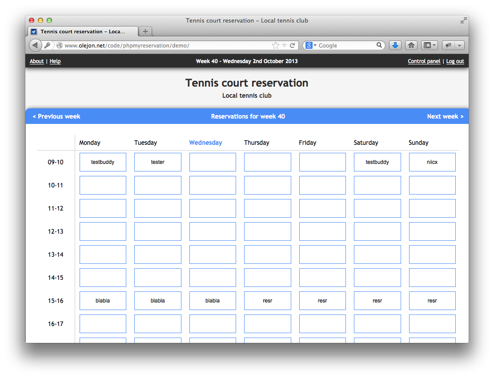
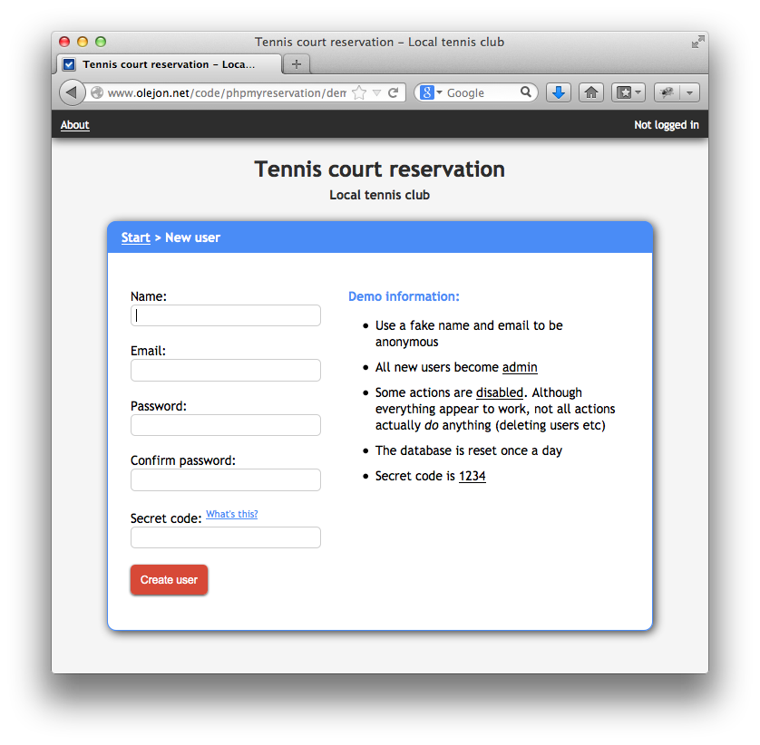

phpMyReservation
================

Fork of [OleJon's](http://www.olejon.net) wonderful timeslot booking system for PHP and MySQL hosts.

####Features
    Fast, easy & smooth
    User login
    Browse through all weeks of the year
    A price per reservation can be set
    Usage is stored automatically
    User control panel
    Advanced admin control panel
    Receive reservation reminders by email 
    
####Requirements

#####Server:
        Web server with PHP
        MySQL 

#####Client:
        A modern browser 

####Screenshots

####Demo
[This is a hosted demo of 1.0 of the project](http://www.olejon.net/code/phpmyreservation/?demo)

####Installation
1. Clone this repo
2. Import phpmyreservation.sql into mysql or use phpMyAdmin
3. Edit config.php. Secret code is 1234 by default. Set to 0 to disable.
4. Move the phpmyreservation folder to where it can be reached through your web server
5. If you chose to enable reservation reminders in config.php, read this to make it work
6. Open phpMyReservation in a web browser. If you have done everything correctly, you should see the login page
7. Create a new user. The first created user will get admin rights
8. Set the price per reservation in the control panel (just set to 0 if usage is free) 

####Reservation reminders
[Email reminders are documented here](doc/ReservationReminders.md)
